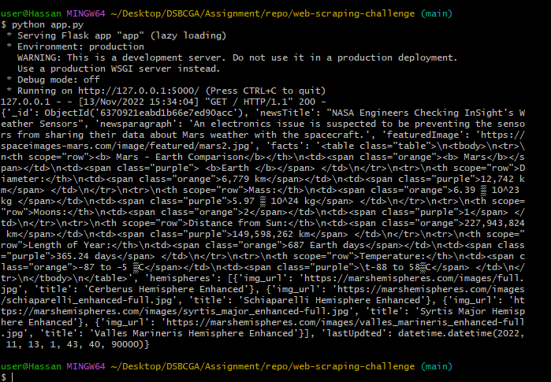

# Web-scraping-challenge

In this assignment, I built a web application that scrapes various websites for data related to the Mission to Mars and displays the information in a single HTML page. The following information outlines what I did

The project consisted of 2 parts

## Part 1: Scraping

Completed initial scraping using Jupyter Notebook, BeautifulSoup, Pandas, and Requests/Splinter.

### NASA Mars News

Scraped the Mars News Site and collect the latest News Title and Paragraph Text. Assign the text to variables that you can reference later.

### JPL Mars Space Images—Featured Image

Use Splinter to navigate the site and find the image URL for the current Featured Mars Image, then assign the URL string to a variable called featured_image_url.

Found the image URL to the full-sized .jpg image.

Saved a complete URL string for this image.

### Mars Facts

Visited the Mars Facts webpage and used Pandas to scrape the table containing facts about the planet including diameter, mass, etc.

Used Pandas to convert the data to a HTML table string.

.....

### Mars Hemispheres

Visited the astrogeology site to obtain high-resolution images for each hemisphere of Mars.

You will need to click each of the links to the hemispheres in order to find the image URL to the full-resolution image.

Saved the image URL string for the full resolution hemisphere image and the hemisphere title containing the hemisphere name. Used a Python dictionary to store the data using the keys img_url and title.

Appended the dictionary with the image URL string and the hemisphere title to a list. This list will contain one dictionary for each hemisphere.

## Part 2: MongoDB and Flask Application
Used MongoDB with Flask templating to create a new HTML page that displays all the information that was scraped from the URLs above.

 converted your Jupyter notebook into a Python script called scrape_mars.py by using a function called scrape. This function should  execute all your scraping code from above and return one Python dictionary containing all the scraped data.

Next, created a route called /scrape that will import your scrape_mars.py script and call your scrape function.

Stored the return value in Mongo as a Python dictionary.

Created a root route / that will query your Mongo database and pass the Mars data into an HTML template for displaying the data.

Created a template HTML file called index.html that will take the Mars data dictionary and display all the data in the appropriate HTML elements. Use the following as a guide for what the final product should look like, but feel free to create your own design.

